# Implementation Plan: Performance Optimization

## Overview

This implementation plan addresses severe performance issues in the Black & White e-commerce website by implementing a comprehensive multi-layer caching strategy, database query optimization, and frontend loading improvements. The goal is to reduce page load time from 60+ seconds to under 3 seconds.

## Tasks

- [x] 1. Create Cache Service Module
- [x] 2. Add MongoDB Indexes
- [x] 3. Configure Database Connection Pooling
- [x] 4. Implement Optimized Storefront API with Caching
- [x] 5. Add Cache Invalidation to Admin Endpoints
- [x] 6. Implement Cache Warming on Server Startup
- [x] 7. Create Image Optimization Utility
- [x] 8. Create Client-Side Cache Utility
- [x] 9. Create Skeleton Loader Components
- [x] 10. Integrate Client-Side Caching in Storefront
- [x] 11. Integrate Skeleton Loaders in Storefront UI
- [x] 12. Apply Image Optimization to All Product Images
- [~] 13. Optimize Admin Dashboard Image Usage
- [ ] 14. Enhance API Compression Configuration
- [~] 15. Create Health Check Endpoint
- [~] 16. Add Error Handling and Retry Logic to Storefront
- [~] 17. Add Performance Logging Middleware
- [~] 18. Add Selective Data Fetching Support
- [~] 19. Update AdminDashboard Client-Side Caching
- [~] 20. Integration Testing and Performance Validation

### Task 1: Create Cache Service Module
Create a centralized in-memory caching service with TTL support, invalidation, and statistics tracking.

**Files to modify:**
- CREATE `server/services/cacheService.js`

**Implementation details:**
- Implement CacheService class with Map-based storage
- Support get/set/invalidate/clear operations
- Track cache hits/misses for statistics
- Implement TTL expiration logic (fresh < 300s, stale 300-600s, expired > 600s)
- Add warmUp method for cache preloading
- Support wildcard pattern invalidation (e.g., 'storefront:*')

**Acceptance criteria:**
- Cache stores data with timestamp and TTL
- get() returns { data, status: 'HIT'|'STALE'|'MISS', age }
- Stale data (300-600s) returns data with 'STALE' status
- Expired data (>600s) returns 'MISS' status
- getStats() returns { hits, misses, hitRate, size }
- invalidate() supports pattern matching with wildcards

### Task 2: Add MongoDB Indexes
Create database indexes to optimize query performance for products and categories.

**Files to modify:**
- CREATE `server/utils/createIndexes.js`
- MODIFY `server/server.js`

**Implementation details:**
- Create compound index on products: { status: 1, order: 1, _id: 1 }
- Create index on products: { categoryId: 1 }
- Create index on products: { order: 1 }
- Create index on categories: { order: 1 }
- Call createIndexes() after MongoDB connection
- Check if indexes exist before creating
- Log index creation results

**Acceptance criteria:**
- All specified indexes are created successfully
- Indexes are created only if they don't exist
- Index creation is logged to console
- Product queries use indexes (verify with explain())
- Query execution time < 200ms

### Task 3: Configure Database Connection Pooling
Optimize MongoDB connection management with proper pooling configuration.

**Files to modify:**
- MODIFY `server/server.js`

**Implementation details:**
- Add minPoolSize: 10 to mongoose.connect options
- Add maxPoolSize: 50
- Add socketTimeoutMS: 30000
- Add serverSelectionTimeoutMS: 5000
- Add maxIdleTimeMS: 10000
- Add waitQueueTimeoutMS: 5000
- Log pool configuration on successful connection

**Acceptance criteria:**
- Connection pool maintains 10-50 connections
- Pool configuration is logged on startup
- Connections are reused efficiently
- No connection timeout errors under normal load

### Task 4: Implement Optimized Storefront API with Caching
Modify the /api/storefront-data endpoint to use multi-layer caching with stale-while-revalidate pattern.

**Files to modify:**
- MODIFY `server/routes/api.routes.js`

**Implementation details:**
- Import cacheService
- Generate cache key based on requested fields
- Check cache before database query
- Return cached data with X-Cache-Status: HIT for fresh cache
- Return stale data immediately with X-Cache-Status: STALE and trigger background refresh
- Fetch from database on cache MISS and update cache
- Add X-Response-Time header
- Support optional 'fields' query parameter for selective data fetching
- Handle errors with fallback to stale cache

**Acceptance criteria:**
- Cache HIT responses return in < 50ms
- Cache MISS responses include database query + caching
- Stale cache triggers async background refresh
- X-Cache-Status header is set correctly
- fields parameter filters returned data
- Error scenarios fall back to cached data when available

**Dependencies:** 1

### Task 5: Add Cache Invalidation to Admin Endpoints
Implement cache invalidation when data is created, updated, or deleted through admin endpoints.

**Files to modify:**
- MODIFY `server/routes/api.routes.js`

**Implementation details:**
- Add cacheService.invalidate('storefront:*') after product POST/PUT/DELETE
- Add cacheService.invalidate('storefront:*') after category POST/PUT/DELETE
- Add cacheService.invalidate('storefront:*') after settings PUT
- Add cacheService.invalidate('storefront:*') after hero PUT
- Add cacheService.invalidate('storefront:*') after overlay PUT
- Log cache invalidation events

**Acceptance criteria:**
- Cache is cleared after any admin data modification
- Next storefront request fetches fresh data after admin changes
- Cache invalidation is logged
- No stale data served after updates

**Dependencies:** 1, 4

### Task 6: Implement Cache Warming on Server Startup
Pre-populate cache when server starts to ensure first request is fast.

**Files to modify:**
- MODIFY `server/server.js`

**Implementation details:**
- Create warmCache() async function
- Fetch all storefront data after DB connection
- Cache data using cacheService
- Log success/failure with timing
- Retry every 60 seconds if warming fails
- Call warmCache() after mongoose.connect succeeds

**Acceptance criteria:**
- Cache warming completes within 5 seconds
- First user request is served from cache (HIT)
- Warming failure is logged and retried
- Server continues to start even if warming fails

**Dependencies:** 1, 4

### Task 7: Create Image Optimization Utility
Build a utility to optimize Cloudinary image URLs with automatic format and quality settings.

**Files to modify:**
- CREATE `src/utils/imageOptimizer.js`

**Implementation details:**
- Create optimizeImageUrl(url, options) function
- Support context-specific width presets (grid: 600px, modal: 1200px, hero: 1920px)
- Apply q_auto for quality optimization
- Apply f_auto for format optimization (WebP/AVIF)
- Apply w_{width},c_limit for resizing
- Insert transformations into Cloudinary URL path
- Create getImagePriority(index) helper for fetchpriority
- Return original URL if not Cloudinary

**Acceptance criteria:**
- Grid images resize to 600px width
- Modal images resize to 1200px width
- Hero images resize to 1920px width
- q_auto and f_auto are applied to all images
- Transformations are inserted correctly in URL
- Non-Cloudinary URLs pass through unchanged

### Task 8: Create Client-Side Cache Utility
Implement localStorage-based caching with TTL and quota management.

**Files to modify:**
- CREATE `src/utils/clientCache.js`

**Implementation details:**
- Create clientCache object with set/get/invalidate methods
- Store data with timestamp and TTL in localStorage
- Prefix all keys with 'bw_cache_'
- Default TTL: 300 seconds (5 minutes)
- get() checks TTL and returns null if expired
- Handle QuotaExceededError by clearing oldest 25% of entries
- Return { data, age } from get()

**Acceptance criteria:**
- Data is stored in localStorage with timestamp
- Expired entries return null
- Quota errors trigger automatic cleanup
- get() returns age in seconds
- Multiple cache entries can coexist
- Cache survives page refresh

### Task 9: Create Skeleton Loader Components
Build reusable skeleton screen components for loading states.

**Files to modify:**
- CREATE `src/components/SkeletonLoader.jsx`
- MODIFY `src/index.css`

**Implementation details:**
- Create ProductCardSkeleton component
- Create HeroSkeleton component
- Create ProductGridSkeleton component (renders multiple cards)
- Add shimmer animation CSS
- Add fade-in transition CSS
- Use gradient background with animation
- Match skeleton dimensions to actual components

**Acceptance criteria:**
- Skeleton components match layout of actual content
- Shimmer animation is smooth and continuous
- ProductGridSkeleton accepts count prop
- CSS animations work in all modern browsers
- Skeletons are visually distinct but not distracting

### Task 10: Integrate Client-Side Caching in Storefront
Update Storefront component to use localStorage cache and eliminate unnecessary re-fetching.

**Files to modify:**
- MODIFY `src/pages/Storefront.jsx`

**Implementation details:**
- Import clientCache utility
- Check clientCache.get('storefront') before API call
- Use cached data if available and fresh
- Save API response to clientCache after fetch
- Remove i18n.language from useEffect dependency array
- Add loading state management
- Add error state and retry logic
- Update toggleLanguage to not trigger re-fetch

**Acceptance criteria:**
- First load checks localStorage before API
- Fresh cached data (< 5min) renders immediately
- API is called only when cache is missing or expired
- Language switch does not trigger API call
- Cache survives page refresh
- Error state shows retry button

**Dependencies:** 8

### Task 11: Integrate Skeleton Loaders in Storefront UI
Replace loading delays with skeleton screens for better user experience.

**Files to modify:**
- MODIFY `src/pages/Storefront.jsx`

**Implementation details:**
- Import skeleton components from SkeletonLoader.jsx
- Add isLoading state variable
- Show HeroSkeleton when loading
- Show ProductGridSkeleton(count=8) when loading products
- Wrap actual content in fade-in div
- Transition from skeleton to content smoothly

**Acceptance criteria:**
- Skeleton screens appear immediately on page load
- Skeletons match actual layout dimensions
- Smooth fade-in transition when data loads
- No layout shift when transitioning from skeleton to content
- Loading state is properly managed

**Dependencies:** 9, 10

### Task 12: Apply Image Optimization to All Product Images
Update all image rendering to use optimized Cloudinary URLs.

**Files to modify:**
- MODIFY `src/pages/Storefront.jsx`

**Implementation details:**
- Import optimizeImageUrl and getImagePriority from imageOptimizer
- Apply optimizeImageUrl to all product grid images with context: 'grid'
- Apply optimizeImageUrl to modal images with context: 'modal'
- Apply optimizeImageUrl to hero image with context: 'hero'
- Add lazy loading to product grid images (loading="lazy")
- Add fetchpriority="high" to first 4 products
- Apply to search result images
- Apply to product modal thumbnails

**Acceptance criteria:**
- All product images use optimized URLs
- Grid images are 600px wide max
- Modal images are 1200px wide max
- First 4 products have fetchpriority="high"
- Remaining products have loading="lazy"
- WebP/AVIF format delivered when supported
- Image file sizes reduced by 50%+

**Dependencies:** 7

### Task 13: Optimize Admin Dashboard Image Usage
Apply image optimization to admin panel product images.

**Files to modify:**
- MODIFY `src/pages/AdminDashboard.jsx`

**Implementation details:**
- Import optimizeImageUrl from imageOptimizer
- Apply optimization to product thumbnail images in table
- Use context: 'thumbnail' (300px)
- Add to product modal preview images

**Acceptance criteria:**
- Admin product thumbnails use optimized URLs
- Thumbnails are 300px wide max
- Page load speed in admin panel improves
- Image quality remains acceptable for admin use

**Dependencies:** 7

### Task 14: Enhance API Compression Configuration
Optimize gzip compression settings for maximum efficiency.

**Files to modify:**
- MODIFY `server/server.js`

**Implementation details:**
- Configure compression middleware with level: 6
- Set threshold: 1024 (only compress > 1KB)
- Keep existing compression() call but add options
- Verify compression header is sent
- Test response size reduction

**Acceptance criteria:**
- Responses > 1KB are compressed
- Compression level is 6 (balanced)
- Content-Encoding: gzip header is present
- /api/storefront-data response reduced by 70%+
- No performance impact from compression overhead

### Task 15: Create Health Check Endpoint
Build monitoring endpoint to expose system health and cache metrics.

**Files to modify:**
- MODIFY `server/routes/api.routes.js`

**Implementation details:**
- Create GET /api/health endpoint
- Return database connection status
- Return cache statistics (hits, misses, hit rate, size)
- Return memory usage (heap used/total)
- Return server uptime
- Return timestamp
- Format response as JSON

**Acceptance criteria:**
- Endpoint returns 200 OK with health data
- Cache stats are accurate
- Database status reflects actual connection
- Memory usage is in MB
- Response time < 100ms
- Can be used for uptime monitoring

**Dependencies:** 1

### Task 16: Add Error Handling and Retry Logic to Storefront
Implement robust error handling with user feedback and automatic retry.

**Files to modify:**
- MODIFY `src/pages/Storefront.jsx`

**Implementation details:**
- Add error state variable
- Add retryCount state variable
- Wrap fetch in try-catch
- Check HTTP response status
- Display error banner with message
- Add retry button in error UI
- Implement automatic retry once after 1 second
- Fall back to cached data on error if available
- Clear error state on successful retry

**Acceptance criteria:**
- Network errors are caught and displayed
- User sees friendly error message
- Retry button triggers new fetch attempt
- Automatic retry happens once
- Cached data is used as fallback when available
- Error state is cleared on success

**Dependencies:** 10

### Task 17: Add Performance Logging Middleware
Implement request timing and logging for monitoring response times.

**Files to modify:**
- MODIFY `server/server.js`

**Implementation details:**
- Create performance logging middleware
- Capture request start time
- Log response time on request completion
- Log cache status from response headers
- Warn if response time > 1000ms
- Include request method, path, and status code
- Format: "[timestamp] method path - status - duration - cache"

**Acceptance criteria:**
- All API requests are logged with timing
- Cache status (HIT/MISS/STALE) is logged
- Slow requests (>1s) trigger warnings
- Logs include all relevant request details
- No performance impact from logging

**Dependencies:** 4

### Task 18: Add Selective Data Fetching Support
Allow clients to request specific data collections to reduce payload size.

**Files to modify:**
- MODIFY `server/routes/api.routes.js`

**Implementation details:**
- Parse 'fields' query parameter from request
- Split comma-separated fields list
- Conditionally fetch only requested collections
- Create separate cache keys for different field combinations
- Return only requested data in response
- Default to all fields if parameter is missing
- Validate field names against allowed values

**Acceptance criteria:**
- ?fields=products,categories returns only those collections
- Different field combinations use separate cache entries
- Invalid field names are handled gracefully
- Omitting fields parameter returns all data
- Response payload size matches requested fields
- Cache keys are unique per field combination

**Dependencies:** 4

### Task 19: Update AdminDashboard Client-Side Caching
Apply client-side caching to admin dashboard data fetching.

**Files to modify:**
- MODIFY `src/pages/AdminDashboard.jsx`

**Implementation details:**
- Import clientCache utility
- Check cache before fetching admin data
- Use separate cache key: 'admin_dashboard'
- Shorter TTL for admin data: 60 seconds
- Clear cache after any admin action (create/update/delete)
- Keep focus-based refresh for real-time updates

**Acceptance criteria:**
- Admin data is cached for 60 seconds
- Cache is cleared after mutations
- Focus event still triggers refresh
- First load checks cache
- Admin actions always fetch fresh data

**Dependencies:** 8

### Task 20: Integration Testing and Performance Validation
Test the complete optimization implementation and verify performance targets are met.

**Files to modify:**
- None (testing only)

**Implementation details:**
- Measure initial page load time with Chrome DevTools
- Verify cache hit rate reaches 90%+
- Test database query times < 200ms
- Measure API response compression ratios
- Test with slow 3G network throttling
- Verify skeleton screens appear immediately
- Test language switching doesn't re-fetch
- Validate cache invalidation on admin updates
- Test error recovery and retry
- Measure image load times
- Verify WebP/AVIF delivery
- Test connection pool under load
- Check memory usage stability

**Acceptance criteria:**
- Initial page load < 3 seconds (cold cache)
- Subsequent loads < 1 second (warm cache)
- Database queries execute in < 200ms
- API responses compressed by 70%+
- Cache hit rate > 90% after warm-up
- Skeleton screens appear within 100ms
- Language switch is instant
- Images load in < 1 second
- No memory leaks over 1 hour test
- All functional tests pass

**Dependencies:** 1, 2, 3, 4, 5, 6, 7, 8, 9, 10, 11, 12, 13, 14, 15, 16, 17, 18, 19

## Task Dependency Graph

```mermaid
graph TD
    T1[Task 1: Cache Service]
    T2[Task 2: MongoDB Indexes]
    T3[Task 3: Connection Pooling]
    T4[Task 4: Cached API]
    T5[Task 5: Cache Invalidation]
    T6[Task 6: Cache Warming]
    T7[Task 7: Image Optimizer]
    T8[Task 8: Client Cache]
    T9[Task 9: Skeleton Components]
    T10[Task 10: Client Caching Integration]
    T11[Task 11: Skeleton Integration]
    T12[Task 12: Image Optimization]
    T13[Task 13: Admin Image Optimization]
    T14[Task 14: Compression Config]
    T15[Task 15: Health Endpoint]
    T16[Task 16: Error Handling]
    T17[Task 17: Logging Middleware]
    T18[Task 18: Selective Fetching]
    T19[Task 19: Admin Caching]
    T20[Task 20: Testing]
    
    T1 --> T4
    T1 --> T5
    T1 --> T6
    T1 --> T15
    T4 --> T5
    T4 --> T6
    T4 --> T17
    T4 --> T18
    T7 --> T12
    T7 --> T13
    T8 --> T10
    T8 --> T19
    T9 --> T11
    T10 --> T11
    T10 --> T16
    
    T1 --> T20
    T2 --> T20
    T3 --> T20
    T4 --> T20
    T5 --> T20
    T6 --> T20
    T7 --> T20
    T8 --> T20
    T9 --> T20
    T10 --> T20
    T11 --> T20
    T12 --> T20
    T13 --> T20
    T14 --> T20
    T15 --> T20
    T16 --> T20
    T17 --> T20
    T18 --> T20
    T19 --> T20
```

## Notes

- Tasks 1-6 focus on backend caching infrastructure
- Tasks 7-13 focus on frontend optimization
- Tasks 14-19 are supporting enhancements
- Task 20 validates the entire implementation
- Backend tasks can be parallelized with frontend tasks
- Testing should be performed after each major phase
